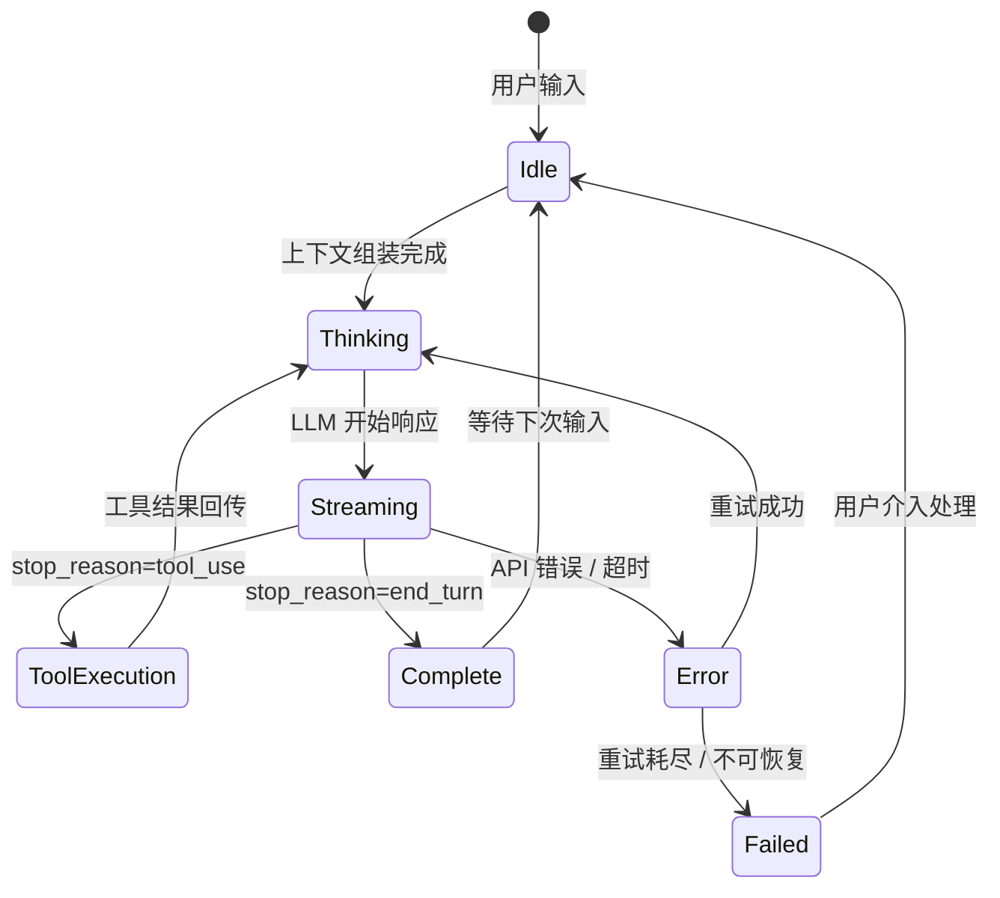
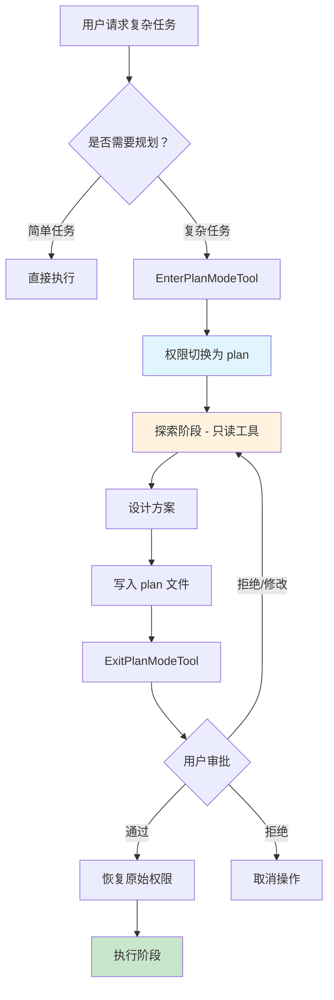
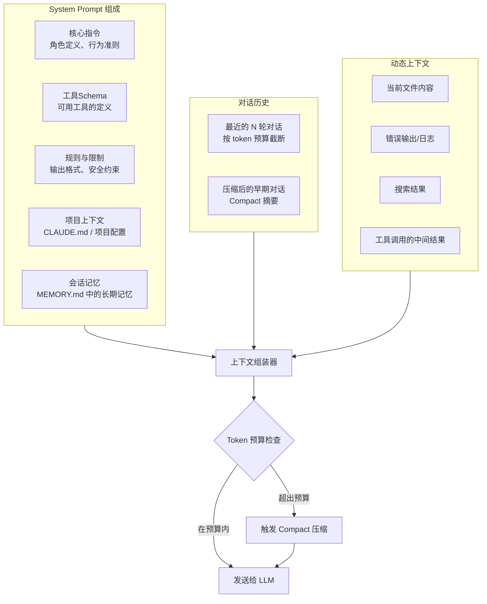
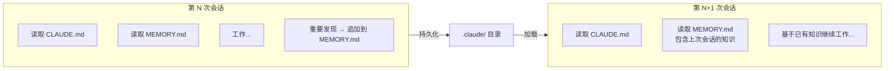
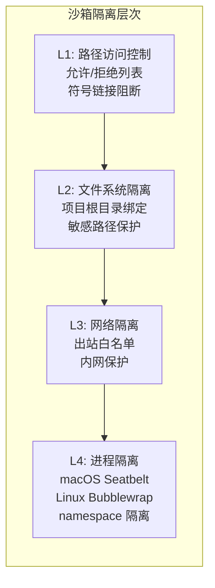
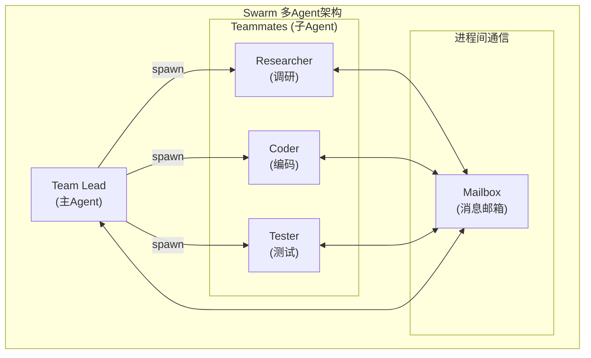
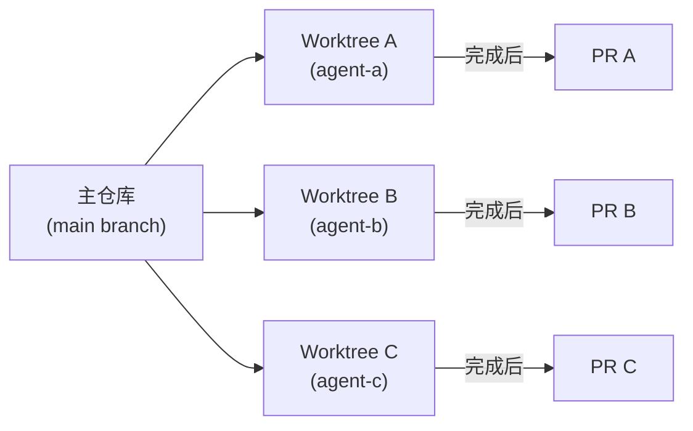

# AI 编程智能体（AI Coding Agent）产品需求文档（PRD）

> **文档版本**：v1.0  
> **创建日期**：2026-05-08  
> **参考基准**：Claude Code 架构设计（45章完整分析）  
> **状态**：初稿  

---

## 目录

1. [产品概述](#1-产品概述)
2. [产品定位与目标用户](#2-产品定位与目标用户)
3. [核心设计原则](#3-核心设计原则)
4. [系统架构总览](#4-系统架构总览)
5. [核心子系统详细设计](#5-核心子系统详细设计)
   - 5.1 [Agentic Loop（Agent 核心循环）](#51-agentic-loopagent-核心循环)
   - 5.2 [流式响应架构](#52-流式响应架构)
   - 5.3 [工具调度与并发执行](#53-工具调度与并发执行)
   - 5.4 [Plan Mode（计划模式）](#54-plan-mode计划模式)
   - 5.5 [上下文管理系统](#55-上下文管理系统)
   - 5.6 [工具架构](#56-工具架构)
   - 5.7 [权限与安全系统](#57-权限与安全系统)
   - 5.8 [多Agent协作（Swarm）](#58多agent协作swarm)
   - 5.9 [UI/交互系统](#59ui交互系统)
   - 5.10 [命令与扩展系统](#510命令与扩展系统)
6. [技术选型方案](#6-技术选型方案)
7. [非功能性需求](#7-非功能性需求)
8. [实施路线图](#8-实施路线图)
9. [风险与应对](#9-风险与应对)

---

## 1. 产品概述

### 1.1 产品定义

本产品是一款**面向开发者的 AI 编程智能体（AI Coding Agent）**，能够在终端/IDE环境中自主理解代码库、执行编程任务、进行代码修改和调试。它不是简单的代码补全工具或聊天机器人，而是一个具有**自主决策能力、工具使用能力和多步骤任务执行能力**的智能代理系统。

### 1.2 核心价值主张

| 维度 | 价值描述 |
|------|----------|
| **自主性** | Agent 能独立完成从理解需求到编写代码、测试验证的全流程，无需人工逐步指导 |
| **上下文感知** | 深度理解整个代码库的结构、模式、约定，而非局限于当前文件 |
| **安全性** | 多层安全防护，确保 Agent 的操作可控、可审计、可回滚 |
| **可扩展性** | 开放的插件/MCP协议，支持自定义工具、技能和工作流 |
| **协作性** | 支持多人协作、会话迁移、多Agent并行工作 |

### 1.3 与现有产品的差异化

```
┌─────────────────────────────────────────────────────────────────┐
│                      AI 编程工具谱系                             │
├──────────────┬──────────────┬──────────────┬─────────────────────┤
│  代码补全    │  聊天编程     │  AI 编程助手 │  AI 编程智能体(本产品) │
│  Copilot     │  ChatGPT     │  Cursor      │  / Claude Code      │
│  单文件级别  │  无代码库感知 │  有限自主性  │  全栈自主决策        │
│  被动响应    │  无执行能力  │  半自动      │  全自动+人工确认      │
└──────────────┴──────────────┴──────────────┴─────────────────────┘
```

---

## 2. 产品定位与目标用户

### 2.1 目标用户画像

| 用户类型 | 典型场景 | 核心诉求 |
|----------|----------|----------|
| **全栈开发者** | 快速实现新功能、重构代码、编写测试 | 减少重复劳动，加速开发迭代 |
| **Tech Lead / 架构师** | 代码审查、技术方案生成、架构迁移 | 保证质量，提升团队效率 |
| **DevOps 工程师** | CI/CD 配置、脚本编写、基础设施代码 | 自动化运维，减少人为错误 |
| **初学者 / 学生** | 学习编程、理解代码逻辑、完成作业 | 降低门槛，获得实时指导 |
| **企业团队** | 统一编码规范、知识沉淀、安全合规 | 团队协作，管控风险 |

### 2.2 使用场景

#### 场景 A：功能开发
```
用户: "帮我给用户模块添加一个密码重置功能"
Agent: 
  1. 探索代码库 → 理解现有的认证体系
  2. 设计方案 → 进入Plan Mode编写实施计划
  3. 用户审批 → 确认方案后开始实施
  4. 执行修改 → 创建API路由、Service层、前端页面
  5. 运行测试 → 自动验证功能正确性
  6. 提交代码 → 生成commit message并提交
```

#### 场景 B：Bug 修复
```
用户: "登录接口在并发情况下偶尔返回500错误"
Agent:
  1. 分析错误日志 → 定位问题代码
  2. 阅读相关代码 → 理解竞态条件根因
  3. 制定修复方案 → 添加分布式锁/事务控制
  4. 实施修复 → 编辑相关文件
  5. 验证修复 → 编写并运行回归测试
```

#### 场景 C：代码审查
```
用户: "/review PR #1234"
Agent:
  1. 获取PR变更 → 拉取diff信息
  2. 分析变更内容 → 逐文件审查
  3. 识别潜在问题 → 安全漏洞、性能问题、风格违规
  4. 生成审查报告 → 结构化反馈建议
```

### 2.3 产品形态

| 形态 | 描述 | 优先级 |
|------|------|--------|
| **CLI 终端应用** | 命令行交互界面，类似 Claude Code 的核心体验 | P0 |
| **IDE 插件** | VS Code / JetBrains 插件，深度集成开发环境 | P1 |
| **Web UI** | 浏览器端界面，支持远程协作和 Teleport | P2 |
| **API 服务** | RESTful API，供第三方集成和自动化调用 | P2 |

---

## 3. 核心设计原则

参考 Claude Code 的设计哲学，确立以下核心原则：

### 3.1 架构原则

| 原则 | 描述 | 参考来源 |
|------|------|----------|
| **Agentic First** | 以 Agent 自主循环为核心设计，而非以工具调用为核心 | Ch05: Agentic Loop |
| **Context is King** | 上下文窗口是最稀缺资源，一切设计围绕高效利用上下文 | Ch10-Ch13 |
| **Security by Layers** | 纵深防御，每层独立有效 | Ch20-Ch23 |
| **Permission-Driven** | 权限系统驱动行为约束，而非依赖提示词引导 | Ch08, Ch20 |
| **Graceful Degradation** | 任何环节失败都应有优雅降级策略 | Ch39 |

### 3.2 工程原则

| 原则 | 描述 |
|------|------|
| **Interface over Inheritance** | 使用 tagged union 类型（如 Command 类型），而非类继承体系 |
| **Metadata/Implementation Separation** | 元数据与实现分离，支持延迟加载 |
| **Fail Fast, Recover Gracefully** | 快速失败，优雅恢复 |
| **Observable Everything** | 全链路可观测，支持调试和诊断 |
| **Pluggable Architecture** | 命令、工具、插件均可插拔扩展 |

---

## 4. 系统架构总览

### 4.1 分层架构

```
┌─────────────────────────────────────────────────────────────────────┐
│                         用户交互层 (Presentation)                     │
│  ┌─────────────┐  ┌─────────────┐  ┌─────────────┐  ┌────────────┐ │
│  │  CLI/Terminal│  │  IDE Plugin │  │   Web UI    │  │   API     │ │
│  │  (Ink/React)│  │  (VS Code)  │  │  (Teleport) │  │  (REST)   │ │
│  └──────┬──────┘  └──────┬──────┘  └──────┬──────┘  └─────┬─────┘ │
└─────────┼────────────────┼────────────────┼────────────────┼───────┘
          │                │                │                │
┌─────────▼────────────────▼────────────────▼────────────────▼───────┐
│                          命令与路由层 (Commands)                       │
│  ┌─────────────────────────────────────────────────────────────┐    │
│  │  Command Router │ Prompt Commands │ Local Commands │ JSX Cmds│    │
│  └─────────────────────────────────────────────────────────────┘    │
├─────────────────────────────────────────────────────────────────────┤
│                         Agent 核心层 (Core)                          │
│  ┌──────────────┐  ┌──────────────┐  ┌──────────────────────────┐  │
│  │ Agentic Loop │  │ Plan Mode    │  │ Context Manager          │  │
│  │ (Think→Act→  │  │ (思考/行动   │  │ - Assembly 组装          │  │
│  │  Observe)    │  │  分离)       │  │ - Compact 压缩           │  │
│  │              │  │              │  │ - Memory 记忆            │  │
│  └──────────────┘  └──────────────┘  └──────────────────────────┘  │
│  ┌──────────────┐  ┌──────────────┐  ┌──────────────────────────┐  │
│  │ QueryEngine  │  │ Swarm Orch.  │  │ Permission System        │  │
│  │ (查询编排)   │  │ (多Agent协调) │  │ - Rules 引擎             │  │
│  │              │  │              │  │ - Runtime 执行            │  │
│  └──────────────┘  └──────────────┘  └──────────────────────────┘  │
├─────────────────────────────────────────────────────────────────────┤
│                          工具层 (Tools)                              │
│  ┌───────┐ ┌───────┐ ┌───────┐ ┌───────┐ ┌───────┐ ┌───────────┐ │
│  │ File  │ │ Bash  │ │ Glob  │ │ Grep  │ │ WebFetch│ │ MCP Tools │ │
│  │ Read  │ │ Exec  │ │ Search│ │ Search│ │ /Search│ │ (可扩展)  │ │
│  │ Write │ │       │ │       │ │       │ │        │ │           │ │
│  │ Edit  │ │       │ │       │ │       │ │        │ │           │ │
│  └───────┘ └───────┘ └───────┘ └───────┘ └───────┘ └───────────┘ │
├─────────────────────────────────────────────────────────────────────┤
│                          基础设施层 (Infrastructure)                  │
│  ┌────────────┐ ┌────────────┐ ┌────────────┐ ┌────────────────┐  │
│  │ LLM Adapter│  │ Sandbox   │  │ Auth/OAuth │  │ Observability │  │
│  │ (多模型支持)│  │ (隔离执行) │  │ (认证体系) │  │ 日志/遥测/诊断│  │
│  └────────────┘ └────────────┘ └────────────┘ └────────────────┘  │
│  ┌────────────┐ ┌────────────┐ ┌────────────┐ ┌────────────────┐  │
│  │ Config Mgr │  │ FeatureFlag│  │ Cost Control│  │ State Machine│  │
│  │ (配置管理) │  │ (特性开关) │  │ (成本管控) │  │ (状态机)     │  │
│  └────────────┘ └────────────┘ └────────────┘ └────────────────┘  │
└─────────────────────────────────────────────────────────────────────┘
```

### 4.2 核心数据流

```
用户输入
   │
   ▼
[输入解析] → [命令路由] → [意图识别]
   │                           │
   ▼                           ▼
[上下文组装] ←────────── [Agentic Loop 启动]
   │                        
   ▼                    ┌───────────────┐
[System Prompt 构建]   │               │
   │                   ▼               ▼
   ▼            [LLM 流式请求]    [Tool 调度]
   │                   │               │
   ▼                   ▼               ▼
[SSE 解析] ←──── [Tool 执行结果聚合] ← [并行工具执行]
   │
   ▼
[UI 渲染更新]
   │
   ▼
[等待下一次循环 / 结束]
```

### 4.3 请求生命周期

```
1. 用户输入 → 2. 输入预处理 → 3. 命令判断 → 4. 上下文组装
                                                        ↓
8. 结果展示 ← 7. 响应渲染 ← 6. 流式输出 ← 5. LLM 推理 + Tool Use
                                                        ↓
                                              5a. stop_reason == tool_use?
                                                    ↓ Yes
                                              5b. Tool 参数解析
                                                    ↓
                                              5c. 权限检查
                                                    ↓
                                              5d. 并行工具执行
                                                    ↓
                                              5e. 结果聚合 → 回到 5
```

---

## 5. 核心子系统详细设计

### 5.1 Agentic Loop（Agent 核心循环）

#### 5.1.1 设计目标

Agentic Loop 是整个产品的"心脏"，驱动 Agent 的"思考→行动→观察"循环。

#### 5.1.2 核心算法

```typescript
// 伪代码：核心 Agentic Loop
async function executeAgentLoop(
  userMessage: string,
  context: AgentContext,
): Promise<AgentResult> {
  const maxIterations = context.maxIterations || 100
  
  for (let iteration = 0; iteration < maxIterations; iteration++) {
    
    // Step 1: 组装消息（System Prompt + History + User Message）
    const messages = await assembleMessages(context)
    
    // Step 2: 调用 LLM API（流式）
    const stream = await llmClient.stream(messages, {
      tools: context.availableTools,
      max_tokens: context.maxTokens,
    })
    
    // Step 3: 解析流式响应
    const response = await parseStream(stream)
    
    // Step 4: 发送给 UI 渲染
    uiRenderer.renderResponse(response)
    
    // Step 5: 判断停止原因
    if (response.stopReason === 'end_turn') {
      // Agent 认为任务完成
      return { status: 'completed', response }
    }
    
    if (response.stopReason === 'tool_use') {
      // Agent 请求使用工具
      const toolUses = response.toolUses
      
      // Step 6: 权限检查 + 工具调度
      const results = await scheduleAndExecuteTools(toolUses, context)
      
      // Step 7: 将工具结果追加到对话历史
      context.appendToolResults(results)
      
      // 继续下一轮循环
      continue
    }
    
    // 其他 stop_reason 处理...
  }
  
  return { status: 'max_iterations_reached' }
}
```

#### 5.1.3 关键设计决策

| 决策点 | 选择 | 理由 |
|--------|------|------|
| **循环终止条件** | `stop_reason === 'end_turn'` 或达到最大迭代次数 | 防止无限循环，LLM 自主决定何时结束 |
| **最大迭代次数** | 默认 100，可配置 | 平衡任务复杂度和安全性 |
| **流式处理** | SSE 从 LLM 到 UI 全链路流式 | 即时反馈，提升用户体验 |
| **工具结果处理** | 所有并行工具完成后统一回传 | 保证上下文完整性 |

#### 5.1.4 循环状态机



---

### 5.2 流式响应架构

#### 5.2.1 架构图

```
┌─────────────┐     SSE      ┌──────────────┐     WebSocket/EventBus   ┌──────────┐
│  LLM API    │ ──────────→  │ StreamParser │ ─────────────────────→  │   UI     │
│ (Provider)  │              │              │                         │ Renderer │
└─────────────┘              └──────────────┘                         └──────────┘
                                     │
                                     ↓
                            ┌──────────────────┐
                            │ StreamingToolExec │  ← 工具输出实时推送
                            │ (工具执行流式化)   │
                            └──────────────────┘
```

#### 5.2.2 流式解析器设计

```typescript
interface StreamParser {
  // 解析 SSE 事件流
  parseStream(stream: ReadableStream): AsyncGenerator<StreamEvent>
  
  // 事件类型
  // - content_block_start: 新内容块开始
  // - content_block_delta: 内容增量（文本/工具调用参数）
  // - content_block_stop: 内容块结束
  // - message_start/stop: 消息开始/结束
}

interface StreamEvent {
  type: 'text_delta' | 'tool_use_start' | 'tool_use_delta' | 'tool_use_stop' | 'done'
  payload: unknown
}
```

#### 5.2.3 StreamingToolExecutor

对于耗时工具（如 Bash 执行），支持实时将工具输出推送到 UI：

```typescript
class StreamingToolExecutor {
  async executeToolWithStreaming(
    toolUse: ToolUse,
    context: ExecutionContext,
  ): Promise<AsyncGenerator<ToolOutputChunk>> {
    const generator = tool.execute(toolUse.input, context)
    
    for await (const chunk of generator) {
      // 实时推送到 UI
      eventBus.emit('tool_output', {
        toolUseId: toolUse.id,
        chunk,
      })
      yield chunk
    }
  }
}
```

---

### 5.3 工具调度与并发执行

#### 5.3.1 依赖感知调度

当 Agent 在单次响应中请求多个工具时，需要智能调度：

```typescript
interface ToolSchedulePlan {
  // 第一批：无依赖的工具，立即并行执行
  parallel: ToolUse[]
  
  // 第二批：依赖第一批结果的工具
  sequential: ToolUse[]
}
```

#### 5.3.2 调度算法

```typescript
async function gatherToolsWithDependencies(
  toolUses: ToolUse[],
  context: ExecutionContext,
): Promise<ToolResultMap> {
  // 1. 分析工具间依赖关系
  const dependencyGraph = buildDependencyGraph(toolUses)
  
  // 2. 拓扑排序
  const layers = topologicalSort(dependencyGraph)
  
  // 3. 按层执行（同层内并行）
  const results = new Map<string, ToolResult>()
  
  for (const layer of layers) {
    const layerResults = await Promise.allSettled(
      layer.map(tool => executeSingleTool(tool, context))
    )
    
    // 合并结果
    for (let i = 0; i < layer.length; i++) {
      results.set(layer[i].id, resolveResult(layerResults[i]))
    }
  }
  
  return results
}
```

#### 5.3.3 并发控制

| 参数 | 默认值 | 说明 |
|------|--------|------|
| 最大并行工具数 | 10 | 防止资源耗尽 |
| 单工具超时 | 120秒（Bash）/ 30秒（其他） | 防止挂起 |
| 总超时 | 10分钟 | 防止长时间运行 |

---

### 5.4 Plan Mode（计划模式）

#### 5.4.1 设计理念

Plan Mode 将 Agent 的工作分为两个阶段：
- **思考阶段（只读）**：探索代码库、设计方案、写入 plan 文件
- **行动阶段（读写）**：执行实际代码修改

这通过**权限系统**强制分离，而非仅靠提示词引导。

#### 5.4.2 权限模式定义

```typescript
type PermissionMode =
  | 'default'      // 默认模式：所有操作需确认
  | 'auto'         // 自动模式：AI 分类器自动审批安全操作
  | 'plan'         // 计划模式：只读操作
  | 'bypassPermissions'  // 绕过权限（仅限可信环境）
  | 'acceptEdits'  // 自动接受编辑

interface PermissionModeConfig {
  mode: PermissionMode
  title: string
  shortTitle: string
  symbol: string  // UI 图标
  color: string   // 主题色
}
```

#### 5.4.3 Plan Mode 工作流



#### 5.4.4 Plan Mode 下可用工具

| 工具 | isReadOnly | Plan Mode 行为 |
|------|------------|----------------|
| Read | ✅ | 正常使用 |
| Glob | ✅ | 正常使用 |
| Grep | ✅ | 正常使用 |
| WebFetch | ✅ | 正常使用 |
| AskUserQuestion | ✅ | 正常使用 |
| **Bash** | ⚠️ 取决于命令 | 仅允许只读命令（cat, ls, grep...） |
| **Write/Edit** | ❌ | **被拒绝** |
| NotebookEdit | ❌ | **被拒绝** |

特殊例外：**plan 文件本身**可以写入（路径白名单）。

---

### 5.5 上下文管理系统

上下文窗口是 Agent 最稀缺的资源。本子系统负责高效管理上下文的组装、压缩和跨会话记忆。

#### 5.5.1 上下文组装策略



#### 5.5.2 Token 预算分配

假设模型上下文窗口为 200K tokens：

| 组成部分 | 预算占比 | 约 Token 数 |
|----------|----------|-------------|
| System Prompt | 15% | ~30K |
| 对话历史 | 50% | ~100K |
| 动态上下文（文件、搜索等） | 30% | ~60K |
| 安全余量 | 5% | ~10K |

#### 5.5.3 Compact（上下文压缩）

当接近 token 上限时，触发 Compact 操作：

```typescript
interface CompactStrategy {
  // 触发条件
  triggerThreshold: number    // 如：上下文占用 > 80%
  
  // 压缩方式
  method: 'summarization' | 'key_extraction' | 'hybrid'
  
  // 保留策略
  preserveRules: [
    '最后 3 轮完整对话不压缩',
    'plan 文件内容保留',
    '错误信息保留',
    '用户明确要求保留的内容',
  ]
}
```

**压缩流程**：
1. 将早期对话提取为独立文本
2. 调用轻量级 LLM（如 Haiku）生成摘要
3. 用摘要替换原始对话
4. 保留最近几轮完整对话确保连贯性
5. 更新对话历史中的 compact 标记

#### 5.5.4 跨会话记忆（SessionMemory）



**记忆文件规范**：

| 文件 | 用途 | 更新频率 |
|------|------|----------|
| `CLAUDE.md` | 项目级指令、约定、偏好 | 手动维护 / 低频更新 |
| `MEMORY.md` | Agent 积累的项目知识、决策记录 | 每次会话结束追加 |
| `.claude/plans/*.md` | 方案存档 | Plan Mode 生成 |
| `.claude/settings.json` | 项目级配置 | 按需修改 |

---

### 5.6 工具架构

#### 5.6.1 统一工具接口

```typescript
interface Tool<TInput = any, TOutput = any> {
  // 元数据
  name: string
  description: string
  
  // 输入输出 Schema（Zod）
  inputSchema: z.ZodSchema<TInput>
  outputSchema?: z.ZodSchema<TOutput>
  
  // 核心方法
  call(input: TInput, context: ToolContext): Promise<TOutput>
  
  // 生命周期钩子
  validateInput?(input: TInput, context: ToolContext): Promise<ValidationResult>
  checkPermissions?(input: TInput, context: ToolContext): Promise<PermissionDecision>
  
  // 属性声明
  isReadOnly?(input: TInput): boolean
  shouldDefer?: boolean       // 是否延迟加载 Schema
  searchHint?: string         // ToolSearch 的关键词提示
}
```

#### 5.6.2 内置工具清单

| 类别 | 工具名 | 功能 | 只读? |
|------|--------|------|-------|
| **文件操作** | `FileRead` | 读取文件（支持多格式） | ✅ |
| | `FileWrite` | 写入/创建文件 | ❌ |
| | `FileEdit` | 精确字符串替换编辑 | ❌ |
| | `Glob` | 文件模式匹配搜索 | ✅ |
| **Shell** | `Bash` | Shell 命令执行 | ⚠️ |
| **搜索** | `Grep` | 内容正则搜索 | ✅ |
| | `WebSearch` | 网络搜索 | ✅ |
| | `WebFetch` | URL 内容获取 | ✅ |
| **交互** | `AskUserQuestion` | 向用户提问 | ✅ |
| | `EnterPlanMode` | 进入计划模式 | ✅ |
| | `ExitPlanMode` | 退出计划模式 | ✅ |
| **子Agent** | `AgentTask` | 委派子任务 | ✅ |
| **MCP** | `*` | MCP 服务器提供的动态工具 | 取决于工具定义 |

#### 5.6.3 文件操作工具的关键设计

##### FileEdit：精确字符串替换

选择精确字符串替换（而非行号编辑），原因：
1. **LLM 行号不可靠** — 模型生成的行号经常出错
2. **隐式原子性** — 匹配唯一性校验防止误改
3. **乐观锁机制** — 读后写检查防止覆盖冲突

```typescript
// FileEdit 输入 Schema
const FileEditInput = z.object({
  file_path: z.string(),          // 绝对路径
  old_string: z.string(),          // 要替换的文本
  new_string: z.string(),          // 替换后的文本
  replace_all: z.boolean().optional(),  // 是否替换所有匹配
})
```

**安全检查链**：
1. 路径规范化（`expandPath()`）
2. 读后写验证（`readFileState` 检查）
3. 文件修改时间戳比对（乐观锁）
4. `old_string` 唯一性匹配校验
5. 引号归一化处理（弯引号 ↔ 直引号）
6. 敏感信息检测

##### FileRead：多层截断策略

```
请求读取文件
    ↓
文件大小 <= maxSizeBytes? 
    ├── No → 返回错误（文件过大）
    └── Yes → 读取指定范围（offset + limit）
              ↓
         Token 数 <= maxTokens?
         ├── No → 截断到 token 限制
         └── Yes → 返回内容
              ↓
         同文件同范围且未修改?
         ├── Yes → 返回存根（去重优化）
         └── No → 返回完整内容
```

**支持的文件格式**：
- 文本文件（任意编码）
- 图片（PNG/JPG → 自动压缩）
- PDF（按页提取转图片）
- Jupyter Notebook（结构化解析 cell）
- 二进制文件 → 拒绝并引导使用 BashTool

---

### 5.7 权限与安全系统

#### 5.7.1 纵深防御四层架构

```
┌─────────────────────────────────────────────────────────────────┐
│                     Layer 4: 审计日志                            │
│  · 全量操作日志记录                                               │
│  · 不可篡改的审计追踪                                             │
│  · 安全事件告警                                                   │
└─────────────────────────────────────────────────────────────────┘
                              ↑
┌─────────────────────────────────────────────────────────────────┐
│                     Layer 3: 沙箱隔离                            │
│  · 文件系统访问控制（允许/拒绝路径列表）                            │
│  · 网络过滤（白名单域名）                                          │
│  · 进程命名空间隔离（macOS Seatbelt / Linux Bubblewrap）          │
│  · Git bare repo 攻击防护                                         │
└─────────────────────────────────────────────────────────────────┘
                              ↑
┌─────────────────────────────────────────────────────────────────┐
│                     Layer 2: 权限运行时                           │
│  · Allow/Deny/Ask 规则引擎                                        │
│  · AI Classifier 自动审批                                         │
│  · 用户确认对话框                                                 │
│  · 分层权限模式（default/auto/plan/bypass）                        │
└─────────────────────────────────────────────────────────────────┘
                              ↑
┌─────────────────────────────────────────────────────────────────┐
│                     Layer 1: 输入验证                             │
│  · 路径规范化与安全校验                                            │
│  · Schema 校验（Zod）                                             │
│  · 注入攻击防护                                                   │
│  · 敏感信息过滤                                                   │
└─────────────────────────────────────────────────────────────────┘
```

#### 5.7.2 权限规则模型

```typescript
type RuleBehavior = 'allow' | 'deny' | 'ask'

interface PermissionRule {
  // 匹配条件
  toolName: string | pattern       // 工具名或通配符
  filePathPattern?: string         // 文件路径模式（glob）
  commandPattern?: string          // Bash 命令模式（正则）
  
  // 行为
  behavior: RuleBehavior
  
  // 元数据
  source: 'user' | 'system' | 'project'
  priority: number                 // 规则优先级
  description?: string
}
```

**规则示例**：

```jsonc
[
  // 允许读取项目目录下所有文件
  { "toolName": "Read", "filePathPattern": "./**", "behavior": "allow" },
  
  // 禁止写入 ~/.ssh/ 和 ~/.gnupg/
  { "toolName": "*", "filePathPattern": "~/.ssh/**", "behavior": "deny" },
  { "toolName": "*", "filePathPattern": "~/.gnupg/**", "behavior": "deny" },
  
  // 危险 Bash 命令需要确认
  { "toolName": "Bash", "commandPattern": "(rm|sudo|chmod).*-rf", "behavior": "ask" },
  
  // 网络操作需要确认
  { "toolName": "Bash", "commandPattern": "(curl|wget|npm install).*", "behavior": "ask" },
  
  // .env 文件写入需要确认
  { "toolName": "Write", "filePathPattern": "**/.env*", "behavior": "ask" }
]
```

#### 5.7.3 AI Classifier 自动审批

对于 `auto` 模式，使用轻量级 AI 模型分类工具调用是否安全：

```typescript
interface AutoApprovalRequest {
  toolName: string
  input: unknown
  projectContext: ProjectInfo
}

interface AutoApprovalResult {
  approved: boolean
  confidence: number        // 0-1
  reason: string            // 审批理由
  riskLevel: 'safe' | 'low' | 'medium' | 'high'
}
```

**分类维度**：
- 操作是否只读？
- 修改范围是否可控？
- 是否影响生产数据？
- 命令是否可逆？

#### 5.7.4 沙箱设计



**关键安全措施**：
- **个人目录保护**：`~/Desktop`、`~/Downloads`、`~/Documents` 的删除操作需多重确认
- **设备文件黑名单**：阻止 `/dev/zero`、`/dev/random` 等可能导致挂起的设备文件
- **UNC 路径阻断**：Windows 上阻止 `\\server\share` 路径防止 NTLM 凭据泄漏
- **Git bare repo 防护**：检测并阻止针对 git bare repo 的攻击向量

---

### 5.8 多Agent协作（Swarm）

#### 5.8.1 架构概览



#### 5.8.2 消息协议

```typescript
type IPCMessage =
  | { type: 'message'; recipient: string; content: string; summary: string }
  | { type: 'broadcast'; content: string; summary: string }
  | { type: 'shutdown_request'; recipient: string; content: string }
  | { type: 'shutdown_response'; request_id: string; approve: boolean }
  | { type: 'plan_approval_request'; requestId: string; planContent: string }
  | { type: 'plan_approval_response'; requestId: string; approve: boolean }
```

#### 5.8.3 Worktree（Git工作树隔离）

每个子 Agent 在独立的 git worktree 中工作，避免文件冲突：



**Worktree 生命周期**：
1. **创建**：`git worktree add <path> -b <branch>`
2. **使用**：子 Agent 在 worktree 中独立工作
3. **提交**：完成后提交到对应分支
4. **清理**：合并后移除 stale worktree（GC 机制）

---

### 5.9 UI/交互系统

#### 5.9.1 CLI 终端 UI（Ink/React）

采用 React-in-Terminal 方案（类似 Ink 框架）：

```
┌─────────────────────────────────────────────────────────┐
│  🤖 AI Coding Agent                          v1.0.0     │
│  Project: my-app                    branch: feature/x   │
├─────────────────────────────────────────────────────────┤
│                                                         │
│  🧑 You: 帮我给用户模块添加密码重置功能                  │
│                                                         │
│  🤖 Agent:                                             │
│  ┌─────────────────────────────────────────────────┐   │
│  │ 我来帮你实现这个功能。让我先了解一下现有的认证    │   │
│  │ 体系...                                          │   │
│  │                                                  │   │
│  │ 🔍 [正在搜索 auth 相关文件...]                   │   │
│  │ 📖 [读取 src/auth/service.ts]                   │   │
│  │ 📖 [读取 src/auth/routes.ts]                    │   │
│  │                                                  │   │
│  │ 基于代码分析，我发现：                            │   │
│  │ • 认证服务使用 JWT 方案                          │   │
│  │ • 已有 email verification 模块                  │   │
│  │ • 路由在 src/auth/routes.ts 中定义               │   │
│  │                                                  │   │
│  │ 我建议以下实施方案：                              │   │
│  │ 1. 添加 POST /auth/password-reset 请求接口       │   │
│  │ 2. 实现 PasswordResetService                    │   │
│  │ 3. 添加邮件模板                                  │   │
│  │                                                  │   │
│  │ 要进入 Plan Mode 详细规划吗？                    │   │
│  └─────────────────────────────────────────────────┘   │
│                                                         │
│  ⏱️ Tokens: 12,450/100,000  │  💵 Cost: $0.42          │
├─────────────────────────────────────────────────────────┤
│  > 输入消息... (/help 查看命令)                         │
└─────────────────────────────────────────────────────────┘
```

#### 5.9.2 消息渲染管线

```
Raw AI Output (text + tool_use blocks)
       │
       ▼
  [Markdown Parser]
       │
       ▼
  [Syntax Highlighter] ← 代码块
       │
       ▼
  [Tool Result Formatter] ← 工具调用结果
       │
       ▼
  [Terminal Renderer] ← Ink/React 组件树
       │
       ▼
  [Virtual Scroll] ← 大量内容时的虚拟滚动优化
       │
       ▼
  [Screen Output]
```

#### 5.9.3 输入系统

- **多行输入**：支持 Shift+Enter 换行，Enter 发送
- **命令补全**：`/` 触发命令列表，Tab 补全
- **早期输入捕获**：启动期间键入的字符不丢失
- **快捷键**：`Ctrl+C` 中断、`Ctrl+D` 退出、`↑/↓` 历史浏览

---

### 5.10 命令与扩展系统

#### 5.10.1 命令类型

```typescript
type Command = CommandBase & (
  | PromptCommand      // 类型 1: 提示词命令（注入到对话）
  | LocalCommand        // 类型 2: 本地命令（执行逻辑）
  | LocalJSXCommand     // 类型 3: JSX 命令（渲染 UI）
)
```

| 类型 | 示例 | 特点 |
|------|------|------|
| **PromptCommand** | `/review`, `/commit` | 本质是一段提示词，最轻量 |
| **LocalCommand** | `/compact`, `/clear` | 执行本地逻辑，懒加载 |
| **LocalJSXCommand** | `/config`, `/login` | 渲染交互式 UI，最重量级 |

#### 5.10.2 动态命令发现

命令来源（按优先级排序）：
1. **bundledSkills** — 内置技能
2. **builtinPluginSkills** — 内置插件技能
3. **skillDirCommands** — 用户自定义技能（`.skills/` 或 `.claude/skills/`）
4. **workflowCommands** — 工作流脚本
5. **pluginCommands** — 第三方插件命令
6. **COMMANDS()** — 硬编码内置命令

#### 5.10.3 MCP（Model Context Protocol）集成

支持 MCP 协议，允许动态扩展工具集：

```yaml
# mcp_config.example.yaml
servers:
  filesystem:
    command: npx
    args: [-y, @modelcontextprotocol/server-filesystem, /path/to/allowed/dir]
  
  github:
    command: npx
    args: [-y, @modelcontextprotocol/server-github]
    env:
      GITHUB_TOKEN: ${GITHUB_TOKEN}
  
  database:
    command: npx
    args: [-y, @my-org/mcp-postgres-server]
```

---

## 6. 技术选型方案

### 6.1核心技术栈

| 层面 | 选型 | 理由 |
|------|------|------|
| **运行时** | Node.js 20+ / Bun | TypeScript 生态成熟，异步 I/O 强大 |
| **语言** | TypeScript (strict mode) | 类型安全，与 LLM SDK 兼容好 |
| **终端 UI** | Ink (React for CLI) | 组件化开发，React 生态复用 |
| **LLM SDK** | OpenAI SDK兼容层 | 支持多 Provider 切换 |
| **Schema 校验** | Zod | 运行时类型安全，与 TypeScript 聚合 |
| **状态管理** | Zustand / 轻量 Reactive | 轻量，适合 CLI 场景 |
| **配置管理** | JSONC + YAML | 支持注释，层级清晰 |
| **流式传输** | SSE (Server-Sent Events) | 标准、简单、可靠 |

### 6.2 LLM Provider 支持

| Provider | 支持方式 | 优先级 |
|----------|----------|--------|
| **OpenAI** (GPT-4o/o1) | Official SDK | P0 |
| **Anthropic** (Claude) | Official SDK | P0 |
| **Open Source** (Llama, Qwen) | Ollama / vLLM | P1 |
| **国内厂商** (DeepSeek, Moonshot, GLM) | OpenAI Compatible API | P1 |
| **AWS Bedrock** | AWS SDK | P2 |
| **Google Vertex AI** | Google Auth + SDK | P2 |

### 6.3 多模型策略

```typescript
interface ModelConfig {
  id: string
  provider: string
  
  // 能力特征
  maxTokens: number
  supportsVision: boolean
  supportsToolUse: boolean
  supportsStreaming: boolean
  
  // 定价（per million tokens）
  pricing: {
    input: number
    output: number
    cacheRead: number
    cacheWrite: number
  }
  
  // 适用场景
  bestFor: 'coding' | 'reasoning' | 'fast' | 'cheap'
}
```

**推荐模型矩阵**：

| 场景 | 推荐模型 | 理由 |
|------|----------|------|
| 核心推理/编码 | Claude Sonnet / Opus, GPT-4o | 强大的工具使用能力 |
| 快速操作/分类 | GPT-4o-mini, Claude Haiku | 低成本低延迟 |
| 上下文摘要 | Haiku / GPT-4o-mini | 摘要任务不需要最强模型 |
| 复杂推理 | o1, Claude Opus | 复杂分析和规划 |

---

## 7. 非功能性需求

### 7.1 性能指标

| 指标 | 目标值 | 说明 |
|------|--------|------|
| **CLI 启动时间** | < 500ms (快速路径) / < 2s (完整路径) | --version 应瞬间返回 |
| **首响时间 (TTFT)** | < 2s | 用户输入到首个 token |
| **工具执行延迟** | < 100ms (本地) / < 5s (网络) | 不含 LLM 推理时间 |
| **内存占用** | < 200MB (idle) / < 500MB (active) | CLI 模式 |
| **上下文利用率** | > 80% | 有效 token / 总预算 |

### 7.2 可靠性

| 指标 | 目标 |
|------|------|
| **错误恢复率** | > 99% (瞬态错误自动重试) |
| **最大重试次数** | 4 次（指数退避 + 抖动） |
| **降级策略** | Opus → Sonnet → 同步模式 |
| **崩溃恢复** | 对话历史持久化，重启后可恢复 |

### 7.3 安全性

| 维度 | 要求 |
|------|------|
| **认证** | OAuth PKCE + API Key 双通道 |
| **授权** | 基于规则的权限引擎 + AI Classifier |
| **沙箱** | 多层隔离，OS 级行程隔离 |
| **审计** | 全量操作日志，不可篡改 |
| **数据隐私** | 敏感数据脱敏，可选本地部署 |

### 7.4 成本控制

| 机制 | 说明 |
|------|------|
| **Token 预算** | 单会话/单日 token 上限 |
| **成本追踪** | 实时显示当前会话成本 |
| **速率限制** | 渐进式警告（70%→85%→100%） |
| **边际收益检测** | 自动检测 diminishing returns |
| **模型自动降级** | 超预算时切换到更便宜模型 |

---

## 8. 实施路线图

### 8.1 Phase 1：MVP（最小可行产品）—— 8 周

**目标**：实现核心 Agent Loop + 基础工具 + CLI UI

| 周次 | 交付物 |
|------|--------|
| W1-W2 | 项目脚手架搭建、Agentic Loop 核心框架、LLM 适配层 |
| W3-W4 | 基础工具实现（Read/Write/Edit/Bash/Glob/Grep）、流式响应 |
| W5-W6 | CLI 终端 UI（Ink）、消息渲染管线、输入系统 |
| W7-W8 | 权限系统基础版、上下文组装、集成测试、bug 修复 |

**MVP 功能范围**：
- ✅ 核心 Agentic Loop（Think→Act→Observe）
- ✅ 6 个基础工具（Read/Write/Edit/Bash/Glob/Grep）
- ✅ 流式响应（SSE → Terminal）
- ✅ CLI 交互界面
- ✅ 基础权限系统（Allow/Deny/Ask）
- ✅ 单模型支持（OpenAI 兼容 API）
- ✅ 上下文基本组装

**不在 MVP 范围**：
- ❌ Plan Mode
- ❌ 多 Agent（Swarm）
- ❌ MCP 协议
- ❌ 插件系统
- ❌ Teleport 远程协作
- ❌ IDE 插件

### 8.2 Phase 2：增强版 —— 6 周

**目标**：Plan Mode + 上下文管理 + 安全加固 + 多模型

| 周次 | 交付物 |
|------|--------|
| W9-W10 | Plan Mode（进入/退出/方案审批）、上下文压缩（Compact） |
| W11-W12 | 沙箱隔离、AI Classifier 自动审批、多 Provider 支持 |
| W13-W14 | 成本控制系统、命令系统完善、WebSearch/WebFetch 工具 |

### 8.3 Phase 3：协作版 —— 6 周

**目标**：多 Agent 协作 + MCP + 插件 + IDE 集成

| 周次 | 交付物 |
|------|--------|
| W15-W16 | Swarm 多 Agent 架构、Worktree Git 隔离 |
| W17-W18 | MCP 协议集成、插件系统、技能系统 |
| W19-W20 | VS Code 插件（Alpha）、Teleport 远程协作基础版 |

### 8.4 Phase 4：企业版 —— 4 周

**目标**：企业级功能 + 性能优化 + 监控告警

| 周次 | 交付物 |
|------|--------|
| W21-W22 | 组织管理、SSO 集成、审计日志、合规报告 |
| W23-W24 | 性能优化（启动速度/内存/并发）、可观测性平台、文档完善 |

---

## 9. 风险与应对

### 9.1 技术风险

| 风险 | 影响 | 概率 | 应对策略 |
|------|------|------|----------|
| LLM 输出不稳定性 | 高 | 高 | 结构化输出约束 + 重试 + 降级 |
| 上下文窗口溢出 | 高 | 中 | Compact 压缩 + Token 预算 + 分段处理 |
| 工具调用幻觉 | 中 | 中 | Schema 严格校验 + 结果验证 |
| 并发工具冲突 | 中 | 低 | Worktree 隔离 + 文件锁 |
| 安全绕过 | 致命 | 低 | 纵深防御 + 定期安全审计 |

### 9.2 产品风险

| 风险 | 影响 | 概率 | 应对策略 |
|------|------|------|----------|
| 用户信任不足 | 高 | 中 | 透明化操作 + 确认机制 + 可回滚 |
| 成本失控 | 中 | 中 | 成本预算 + 速率限制 + 模型降级 |
| 与 IDE 竞争 | 中 | 中 | 差异化（自主性 + 全栈能力） |
| LLM Provider 变更 | 中 | 低 | 抽象适配层 + 多 Provider 支持 |

### 9.3 应对策略详解

**LLM 输出不稳定性**：
- 使用 structured output（JSON schema）约束工具调用格式
- 实现 3-tier retry（tool/query/system level）
- Fast Mode cooldown：连续失败后暂时降低"野心"

**上下文窗口溢出**：
- 多层预警（70%/85%/100%）
- 自动 Compact（摘要替换早期对话）
- prompt-too-long 时的精准降级（先丢弃搜索结果，再丢弃早期对话）

---

## 附录

### A. 关键术语表

| 术语 | 定义 |
|------|------|
| **Agentic Loop** | Agent 的核心循环：思考→行动→观察→再思考 |
| **Tool Use** | LLM 通过结构化请求调用外部工具的能力 |
| **Stop Reason** | LLM 响应终止的原因（end_turn / tool_use / max_tokens） |
| **Context Window** | LLM 单次能处理的 token 数上限 |
| **Compact** | 上下文压缩机制，用摘要替换早期对话 |
| **Plan Mode** | 将 Agent 的工作分为思考阶段（只读）和行动阶段（读写）的模式 |
| **Sandbox** | 隔离 Agent 操作环境的机制 |
| **MCP** | Model Context Protocol，开放的工具/服务器扩展协议 |
| **Worktree** | Git 的工作树功能，用于创建独立的并行工作副本 |
| **Swarm** | 多 Agent 协作架构，一个 Team Lead 协调多个 Teammate |
| **Teleport** | 会话迁移能力，在不同机器之间无缝转移工作上下文 |

### B. 参考架构（Claude Code 关键模块映射）

| 本产品设计 | 对应 Claude Code 模块 | 章节 |
|-----------|----------------------|------|
| Agentic Loop | `executeAgentLoop()` | Ch05 |
| 流式响应 | `parseStream()` + SSE | Ch06 |
| 工具调度 | `gatherToolsWithDependencies()` | Ch07 |
| Plan Mode | `EnterPlanModeTool` / `ExitPlanModeV2Tool` | Ch08 |
| QueryEngine | Query orchestration layer | Ch09 |
| 上下文组装 | Context assembly strategy | Ch11 |
| Compact | Context compression | Ch12 |
| 会话记忆 | CLAUDE.md / MEMORY.md | Ch13 |
| 工具架构 | Unified `Tool` interface | Ch14 |
| 文件工具 | FileRead/FileEdit/FileWrite | Ch15 |
| Shell 工具 | BashTool + sandbox | Ch16 |
| 搜索工具 | Glob/Grep/WebSearch/WebFetch | Ch17 |
| 子Agent | AgentTool + task delegation | Ch18 |
| MCP | Protocol + server integration | Ch19 |
| 权限模型 | Rules engine | Ch20-21 |
| 沙箱 | OS-level isolation | Ch22 |
| 纵深防御 | 4-layer defense | Ch23 |
| Swarm | Team Lead + Teammates | Ch24 |
| Worktree | Git worktree isolation | Ch25 |
| Teleport | Session portability | Ch26 |
| 后台任务 | Background task execution | Ch27 |
| 全局状态 | AppState design | Ch28-29 |
| 对话持久化 | Conversation persistence | Ch30 |
| 终端 UI | Ink/React framework | Ch31-34 |
| 命令系统 | Pluggable commands | Ch35 |
| 插件系统 | Third-party extensions | Ch36 |
| 技能系统 | Skills framework | Ch37 |
| Feature Flag | Compile-time + runtime flags | Ch38 |
| 错误处理 | Retry engine + degradation | Ch39 |
| 成本控制 | Cost tracking + budget | Ch40 |
| 认证 | OAuth PKCE + multi-provider | Ch41 |
| 可观测性 | Logging + telemetry + diagnostics | Ch42 |
| 启动流程 | Bootstrap sequence | Ch43 |
| 状态机 | App state machine | Ch44 |

---

> **文档结束**
> 
> 本 PRD 基于 Claude Code 架构设计的完整分析（45章）编写，涵盖了从核心循环到边缘功能的全部关键子系统。下一步应进入技术设计评审阶段，对各子系统进行详细的技术方案设计。
